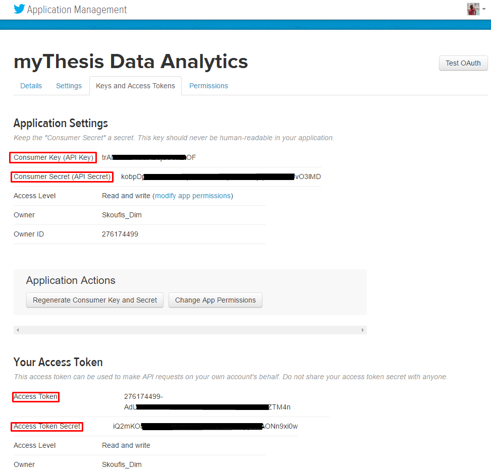

# My Dissertation
Project development for my dissertation

This is a python project for my dissertation.

The idea, is to gather tweets from Twitter with the help of Twitter REST APIs, Search and Streaming. Then all
data will go into a MongoDB instance for storing purposes. Finally, through a GUI, the user will be able to see some statistics or
data analysis by applying some filters.

---
## SPECS:

To be able to run this program there are some TO-DOs:

First you must make a Twitter account and then [create an app](https://apps.twitter.com/) and find your API key (consumer key) and API secret along with Access Token and Access Token Secret.

When finished, go to [credentials.json](Ufiles/credentials.json) and open it with a text editor like Notepad++. Complete your newly acquired credentials, as names state. 

Secondly, make sure you have installed [Python3.5](https://www.python.org/downloads/release/python-350/) & [MongoDB Community Server](https://www.mongodb.com/download-center#production) (I use 3.4).

---
## REQUIREMENTS:

>- Python 3.5 (32bits)
>- MongoDB 3.4.2

#### MODULES\*

- tweepy==3.5.0
- nltk==3.2.4
- pymongo==3.4.0
- matplotlib==2.0.2
- pyproj==1.9.5.1**
- basemap==1.1.0**

**\*install them in the given order**

**to install these modules, first download them from the Unofficial Windows Binaries page:  
 1. [pyproj](http://www.lfd.uci.edu/~gohlke/pythonlibs/#pyproj)
 2. [basemap](http://www.lfd.uci.edu/~gohlke/pythonlibs/#basemap)

#### INSTALLATION

- To install _basemap_ and _pyproj_ after download execute:

    `> pip install C:\path\to\downloaded\file\file_name.whl`
    
- To install the rest of the modules you can:

    `> pip install <module name>`

     You can install all required modules by executing:
     
     `> pip install -r requirements.txt`

---
## IMPORTANT:

Make sure, to **NOT** publish your personal tokens
